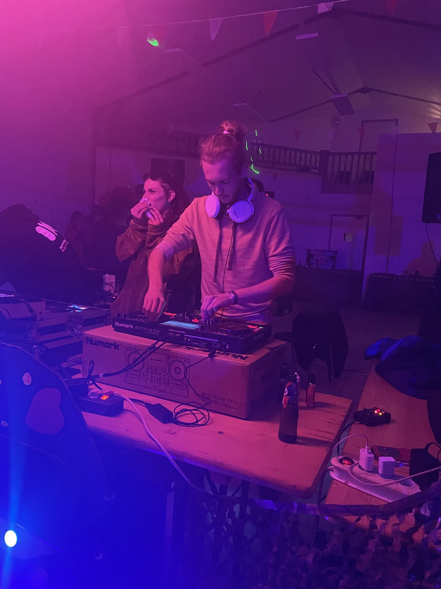

#  Mattéo DELHOMEL

## Sommaire

- [A propos de moi](#À-propos-de-moi)
- [Compétences](#compétences)
- [Projets](#projets)
- [Contact](#contact)

## A propos de moi

Bonjour, je m'appelle **Mattéo Delhomel**.  
Je suis actuellement étudiant en **BUT Informatique**, en **3ème année**, en alternance chez **IMA** (Inter Mutuelle Assistance) comme développeur informatique.

Passionné par l'informatique, je m'intéresse à de nombreux domaines tels que :
- Le développement web
- Le développement d'applications
- La gestion de projets informatiques

Mon objectif est de continuer à développer mes compétences techniques et professionnelles, tout en contribuant activement aux projets qui me sont confiés.

### Passion

Musique :
- DJ évennements techno
- guitare
- batterie

## Compétences

### Developpement web
- React
- Vuejs
- Tailwind
- Nodejs
- Java spring boot
- Golang

### Dévelopement d'application
- Java
- Golang
- Python

## Projets

Durant la periode à l'iut et en entreprise pendant le stage et l'alternance j'ai réalisé de nombreuses applications.

### Projet Legrand : Analyse de données pour les usines
Analyse et traitement des données issues des usines pour améliorer la performance et l'efficacité des processus industriels.  
**Technologies utilisées** : Python, Pandas, Jupyter Notebook.  
**Objectif** : Fournir des insights exploitables en optimisant les données collectées des systèmes de production.

### Catalogue de services pour IMA
Développement d'un catalogue de schémas JSON représentant les données stockées dans un DataHub.  
**Technologies utilisées** : JSON, API REST, Java spring boot, React, Nodejs.  
**Objectif** : Structurer et centraliser les données afin de faciliter leur gestion et leur intégration dans les applications internes.

### IM-Project-Initializr
Création d'une application en **Golang** pour générer des projets à partir de templates (starters) et automatiser la création de dépôts GitLab.  
**Technologies utilisées** : Golang, GitLab API.  
**Objectif** : Standardiser les bonnes pratiques au sein de l'entreprise et simplifier la configuration des nouveaux projets.

Ces projets illustrent mon expérience dans l'analyse de données, le développement backend et la gestion des outils d'intégration continue. Je suis passionné par la résolution de problèmes complexes et l'amélioration des processus métier.

## Contact

Vous pouvez me contacter via les moyens suivants :

- **Email** : [matdelhomel@gmail.com](mailto:matdelhomel@gmail.com)  
- **LinkedIn** : [Mattéo Delhomel](https://www.linkedin.com/in/helicoptere-de-combat/)
- **GitHub** : [Mattéo Delhomel](https://github.com/matteo-delhomel)  

Je suis toujours ouvert à de nouvelles opportunités et collaborations, alors n'hésitez pas à me joindre ! 😊

